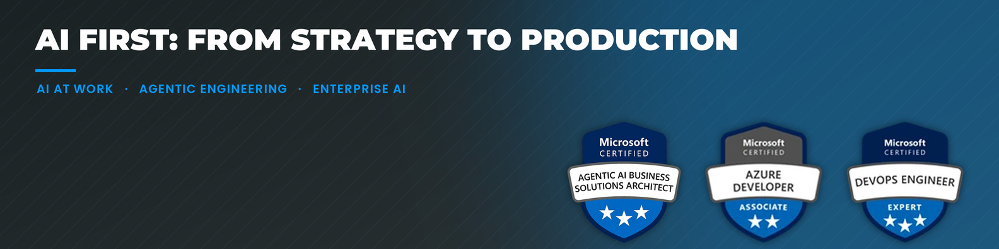

**Agentic AI: from strategy to production.** AI crafted autonomous agents for business processes and workforce AI, with Microsoft 365 and Claude.

### Agentic Solutions

- **Agentic AI**: repetitive processes mapped, scored by business impact, and automated as agent systems on Microsoft Foundry and the Microsoft Agent Framework
- **Agentic Engineering**: GitHub Copilot and Claude Code configured for your stack and your conventions, active in your codebase within days
- **Personal & Autonomous Agents**: Claude Cowork, MCP connectors, skills and agent teams, from one personal setup to specialists that coordinate without supervision

### Professional Services

- **AI Transformation**: discovery that scores each candidate process by ROI, risk and integration complexity, and a phased plan with quick wins sequenced first
- **Architecture & Engineering**: documented architecture, automated evaluations and reproducible environments your team can maintain, extend and debug
- **Training & Team Enablement**: hands-on programs for business users and engineers, built on 30 years of production engineering experience

Microsoft Certified since 1997. Also working in Microsoft 365, Teams, SharePoint and Microsoft Graph; Azure Container Apps, .NET Aspire and Dapr; Angular, TypeScript and micro frontends.

[integrations.at](https://www.integrations.at) · [LinkedIn](https://www.linkedin.com/in/alexander-kastil/) · [Sponsor](https://github.com/sponsors/alexander-kastil)
