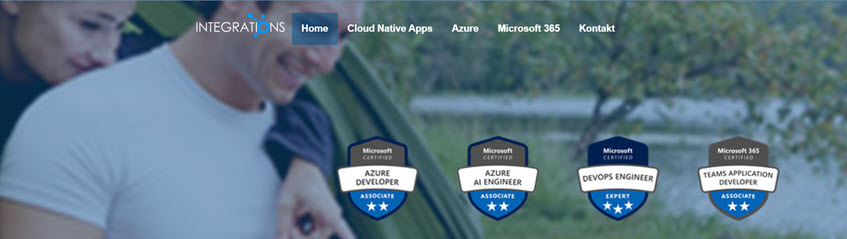

Ask me about: 

- Azure Development, Cloud Native Apps, .NET Aspire & Dapr, Azure Container Apps
- Copilots & AI Agents with Copilot Studio, Semantic Kernel & AutoGen
- Copilot for Microsoft 365 Development: Agents, Plugins & Connectors
- Microsoft 365, Teams & SharePoint Development, Microsoft Graph
- AI assisted Software Development using the GitHub Copilot & Workspaces Ecosystem
- Azure DevOp & Infrastructure as Code
- Angular, Micro-Frontends & Real Time

